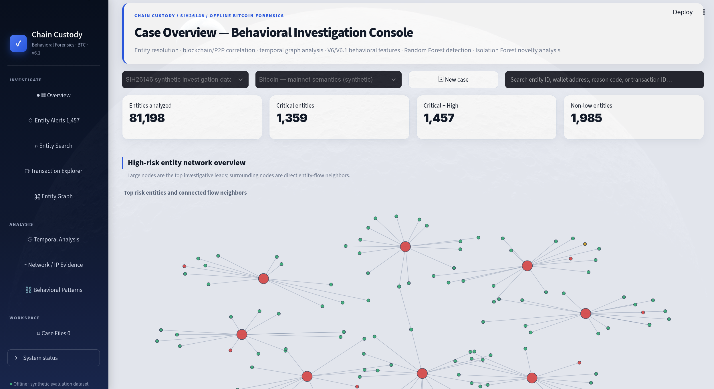
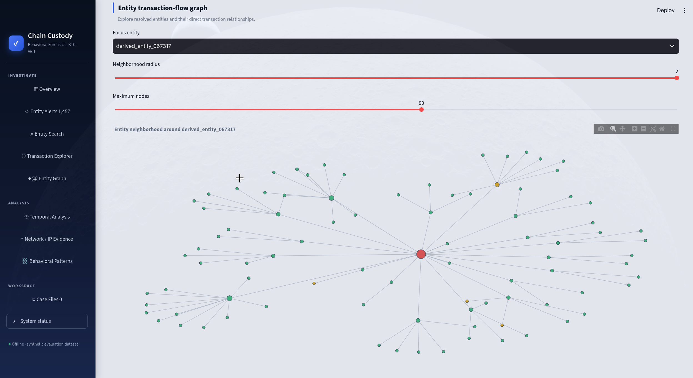

# ₿ Bitcoin Forensics Intelligence Platform

<p align="center">
  <b>AI-assisted blockchain intelligence for suspicious-entity detection,
  behavioral analysis, and explainable forensic investigation.</b>
</p>

<p align="center">
  <b>SIH 2026 · Bitcoin Forensics · V6.1</b>
</p>

---



<p align="center">
  <a href="#-quick-start">Quick Start</a> •
  <a href="#-how-it-works">Architecture</a> •
  <a href="#-behavioral-intelligence">Detection</a> •
  <a href="#-investigation-dashboard">Dashboard</a>
</p>

---

## Overview

The **Bitcoin Forensics Intelligence Platform** is an offline investigative system that combines blockchain transaction data with network-layer metadata to identify suspicious Bitcoin entities and transaction behavior.

The platform performs:

- Blockchain and network-data correlation
- Wallet/entity resolution
- Transaction graph analysis
- Behavioral feature engineering
- Supervised suspicious-behavior detection
- Unsupervised novelty detection
- Explainable risk prioritization
- Interactive forensic investigation

The final system analyzes **81,198 derived entities using 83 behavioral features** and generates prioritized investigative leads through an interactive Streamlit dashboard.

---

## ✨ Key Capabilities

| Capability | Description |
|---|---|
| 🔗 Entity Resolution | Groups related Bitcoin addresses into investigative entities |
| 🕸 Graph Analysis | Reconstructs relationships and transaction flows between entities |
| ⚡ Rapid-Hop Detection | Identifies funds forwarded rapidly between entities |
| 💸 Peel-Chain Analysis | Detects repeated fund-splitting and forwarding behavior |
| 📊 Structuring Detection | Identifies suspicious repeated or structured transaction behavior |
| 🌐 Network Correlation | Correlates blockchain activity with P2P network observations |
| 🧠 Behavioral Detection | Uses 83 behavioral features to classify suspicious activity |
| 🔍 Novelty Detection | Detects unusual entities using Isolation Forest |
| 🏷 Explainable Alerts | Provides human-readable reason codes for alerts |
| 📈 Investigation Dashboard | Provides an interactive interface for exploring results |

---

# 🧠 How It Works

```text
             RAW DATA
                │
       ┌────────┴────────┐
       │                 │
 Blockchain Data    Network Events
       │                 │
       └────────┬────────┘
                ▼
      Blockchain ↔ P2P
          Correlation
                │
                ▼
        Transaction Graph
                │
                ▼
         Entity Resolution
                │
                ▼
       Feature Engineering
                │
       ┌────────┴────────┐
       │                 │
   V6 Features      V6.1 Features
       │                 │
       └────────┬────────┘
                │
        83 Behavioral
           Features
                │
       ┌────────┴────────┐
       │                 │
 Random Forest      Isolation Forest
Behavior Detector   Novelty Detector
       │                 │
       └────────┬────────┘
                ▼
       Explainable Risk
            Alerts
                │
                ▼
      Investigation Dashboard
```

The detector combines two complementary signals:

**Behavioral probability** — how closely an entity resembles known suspicious behavioral patterns.

**Novelty percentile** — how unusual the entity is compared with the wider population.

---

# 🚀 Quick Start

## Linux / macOS

Clone the repository:

```bash
git clone https://github.com/Cap-Eagle/SIH-2026-Bitcoin-Forensics.git
cd SIH-2026-Bitcoin-Forensics
```

Create a virtual environment:

```bash
python3 -m venv .venv
source .venv/bin/activate
```

Install dependencies:

```bash
python -m pip install --upgrade pip
pip install -r requirements.txt
```

Run the complete project:

```bash
chmod +x run_full_project.sh run_pipeline.sh
./run_full_project.sh
```

---

## Windows

Clone the repository:

```powershell
git clone https://github.com/Cap-Eagle/SIH-2026-Bitcoin-Forensics.git
cd SIH-2026-Bitcoin-Forensics
```

Create and activate a virtual environment:

```powershell
python -m venv .venv
.venv\Scripts\activate
```

Install dependencies:

```powershell
python -m pip install --upgrade pip
pip install -r requirements.txt
```

Run:

```powershell
run_full_project.bat
```

---

# 📦 Dataset

Large generated datasets are intentionally **not stored in GitHub**.

The repository contains:

```text
generate_dataset.py
```

which generates the complete synthetic dataset required by the project.

The full-project runner handles dataset generation before executing the forensic pipeline.

Generated data is placed under:

```text
data/
├── raw/
├── correlated/
└── ground_truth/
```

This keeps the repository lightweight while preserving reproducibility.

---

# 🔬 Behavioral Intelligence

The detector uses **83 V6/V6.1 behavioral features** across several feature families:

```text
Transaction Activity
        │
        ├── Timing & Inter-arrival Behavior
        ├── Rapid Spending
        ├── Fund Flow
        ├── Input / Output Structure
        ├── Fan-in / Fan-out
        ├── Amount Distribution
        ├── Structuring Behavior
        ├── Peel Behavior
        ├── Cross-Entity Timing
        ├── Rapid Multi-Hop Chains
        ├── Amount Retention
        └── Network Evidence
```

Feature construction itself is **ground-truth independent**.

Ground-truth labels are used later for supervised model training and benchmark evaluation.

---

# 🚨 Explainable Alerts

Rather than returning only an anomaly score, the final detector produces investigator-friendly reason codes.

Examples include:

```text
RAPID_FORWARDING
RAPID_MULTI_HOP_CHAIN
LAYERING_PATTERN
TRANSACTION_BURST
UNSUPERVISED_NOVELTY
```

Each entity receives information including:

```text
Entity ID
Behavior Probability
Novelty Percentile
Risk Priority
Reason Codes
```

Risk levels are:

```text
CRITICAL
HIGH
MEDIUM
LOW
```

This allows investigators to understand **why an entity was prioritized**, rather than treating the model as a black box.

---

# 🖥 Investigation Dashboard

Launch the dashboard with:

```bash
streamlit run app/dashboard.py
```

The dashboard provides an investigation-oriented interface for exploring:

- Prioritized alerts
- Suspicious entities
- Risk levels
- Behavioral probabilities
- Novelty scores
- Reason codes
- Transaction relationships
- Entity behavior
- Investigative leads

The dashboard is designed as the primary interface for analysts and demonstration users.

### Entity Investigation



Investigators can drill into prioritized entities to inspect behavioral
signals, anomaly indicators, transaction relationships, and the reason
codes responsible for an alert.

---

# 🛠 Usage & Development

The project is designed to be reproducible from the repository without
requiring the generated datasets or intermediate pipeline artifacts to be
stored in Git.

### Run the complete project

Generate the dataset and execute the complete forensic pipeline:

```bash
./run_full_project.sh
```

---

# ⚠️ Scope & Limitations

This platform is an **investigative decision-support system**, not a mechanism for automatically determining criminal activity.

A high-risk alert indicates behavior that warrants further investigation; it does not prove malicious intent.

The included dataset is synthetic and is designed for reproducible development, benchmarking, and demonstration. Performance on real-world blockchain and network datasets may differ.

---

## SIH 2026

**Bitcoin Forensics Intelligence Platform — V6.1**

Built for scalable, explainable, behavior-driven cryptocurrency forensic investigation.
